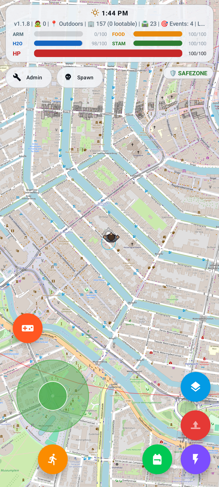
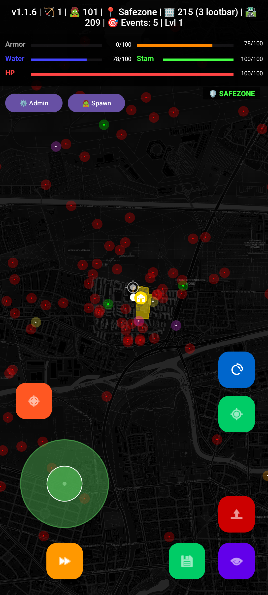
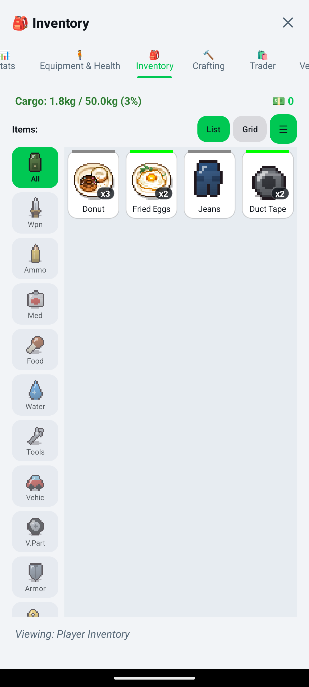
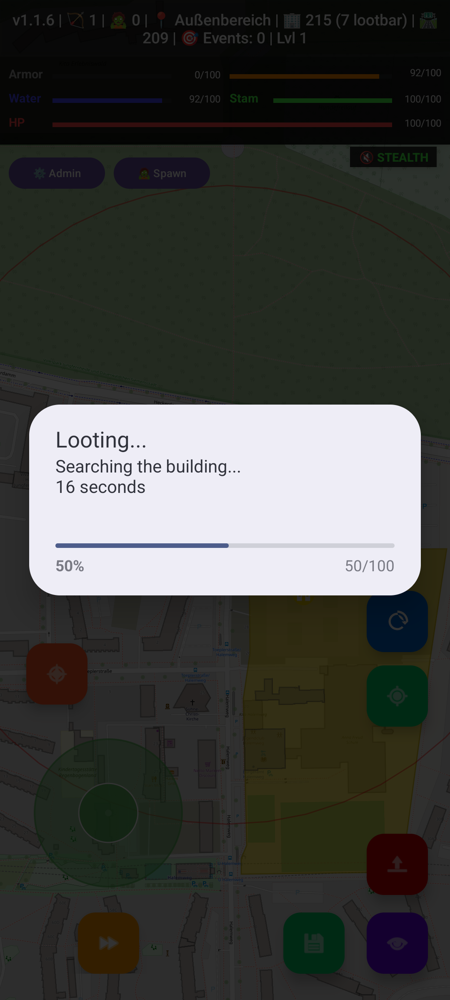
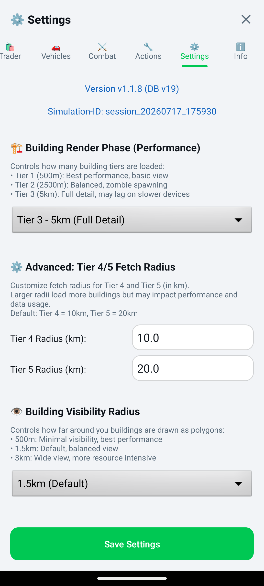
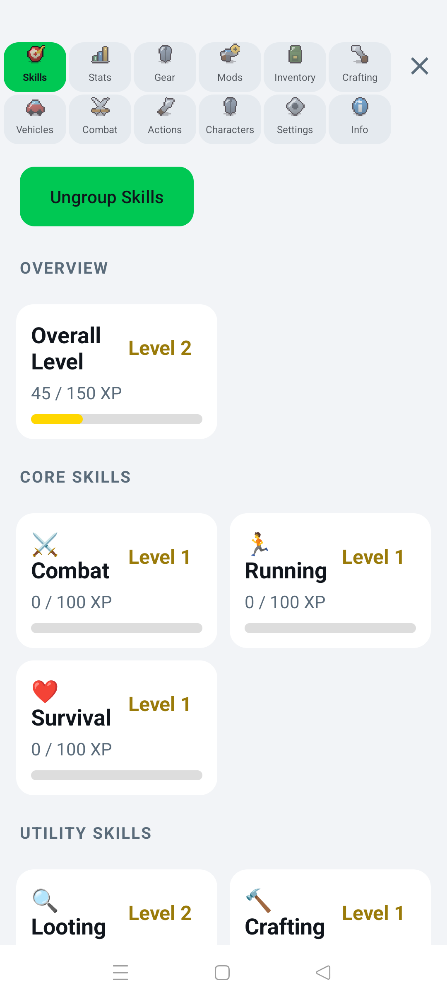
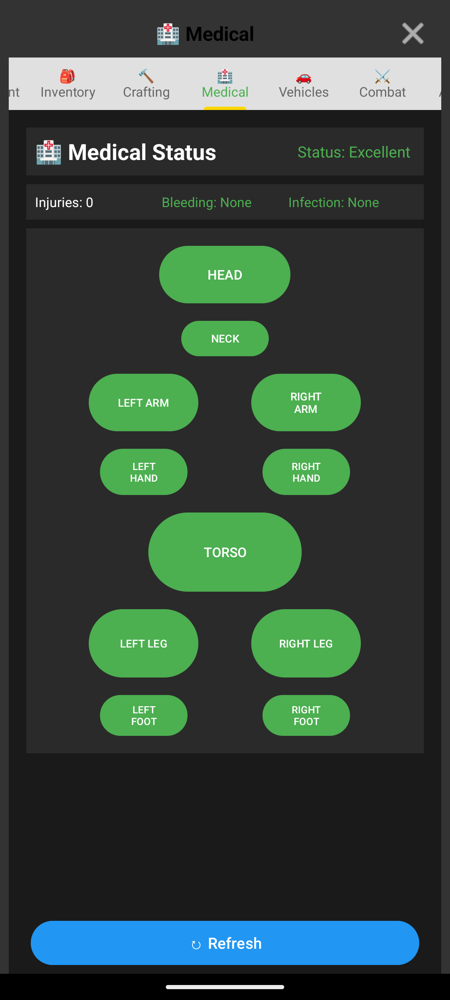
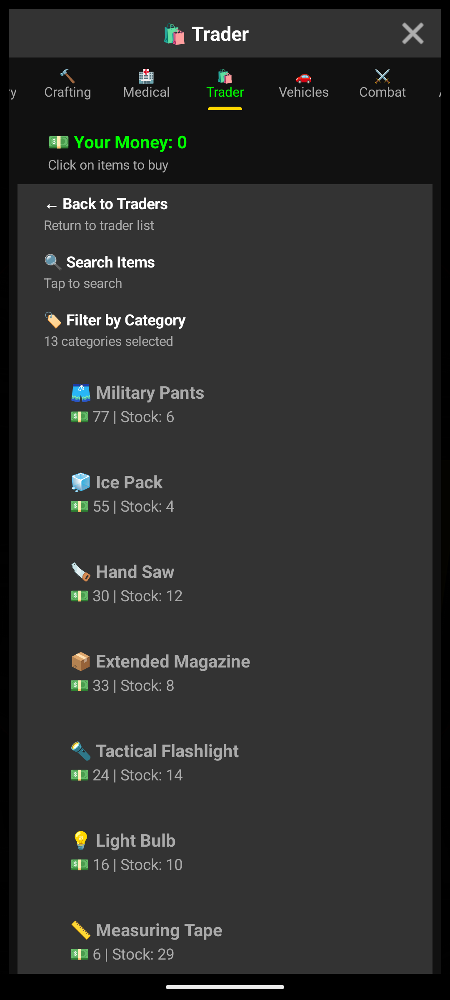

  

    
    
    
    
    
  

  <h1>ZombieEscape</h1>
  
<strong>An open-world, location-based zombie survival game for Android.</strong>

ZombieEscape turns real streets and buildings into a survival game map. Explore your surroundings, collect supplies, fight zombies, meet NPC factions, and gather the resources needed to survive.

The main development repository is private. This public preview repository provides project information, screenshots, development updates, and future Android releases. It does not contain the game's source code.

## Development status

ZombieEscape is playable and under active development. Features, visuals, and balancing may change. Combat and NPC collision avoidance are still being improved.

Current game version: **1.1.8** (version code 10108)

No public APK is available yet. Test builds will be published on the [Releases page](https://github.com/arn-c0de/ZombieEscape-Preview/releases) when they are ready.

## Screenshots

  
  
  
  
  
  
  
  

## Features

- **Real-world map:** Uses OpenStreetMap data for roads, buildings, and landmarks.
- **GPS and joystick movement:** Explore using device location or on-screen controls.
- **Dynamic zombies:** Spawn rates and zombie types depend on the surrounding area.
- **NPC factions:** Hostile, neutral, friendly, and trader NPCs find shelter, collect loot, store items, and defend themselves.
- **Combat:** Supports player-versus-AI and AI-versus-AI encounters.
- **Injuries and treatment:** Tracks injuries by body part, including bleeding, fractures, and infection.
- **Loot and inventory:** Buildings have loot tables and cooldowns, while inventory uses weight limits and item stacks.
- **Crafting and equipment:** Players can craft items and equip weapons, armor, and attachments.
- **Vehicles and aircraft:** Several vehicle types can be acquired, stored, and driven.
- **Persistent world:** The app saves player progress, inventory, vehicles, NPCs, and looted buildings.

## APK releases

Future APK builds will be attached to entries on the [Releases page](https://github.com/arn-c0de/ZombieEscape-Preview/releases). Only install files published directly by this repository. Release notes will identify the Android requirements, known issues, and build type.

## Contributing to the private project

The main repository is not publicly accessible, but collaboration requests are welcome.

To express interest, either [open an issue](https://github.com/arn-c0de/ZombieEscape-Preview/issues/new) in this preview repository or email `arn-c0de@protonmail.com`. Please include:

- A short introduction
- The area you would like to contribute to
- Relevant Android, Kotlin, game development, design, testing, or documentation experience
- Links to previous work, if available

Do not include passwords, access tokens, private keys, or other sensitive information in an issue. Repository access is considered individually and is not guaranteed.

## License and usage

All screenshots, game assets, names, and other material in this repository are provided for project preview purposes unless stated otherwise. They may not be copied, redistributed, sold, or used in another project without prior written permission.

The ZombieEscape source code remains private and is not licensed through this preview repository.

Repository: <https://github.com/arn-c0de/ZombieEscape-Preview>
