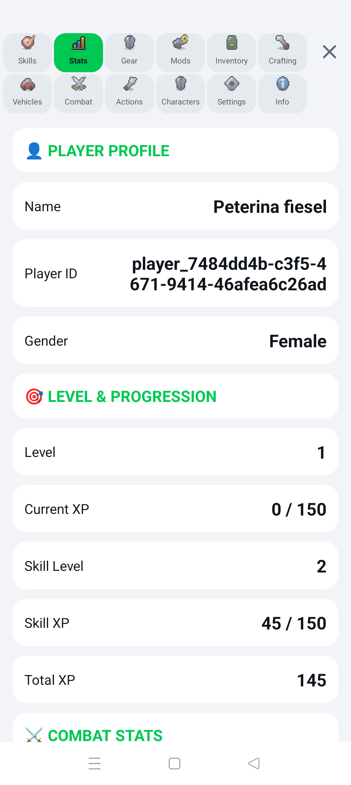
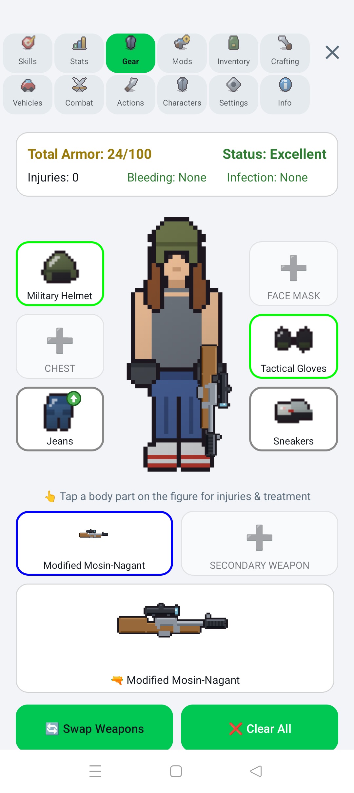
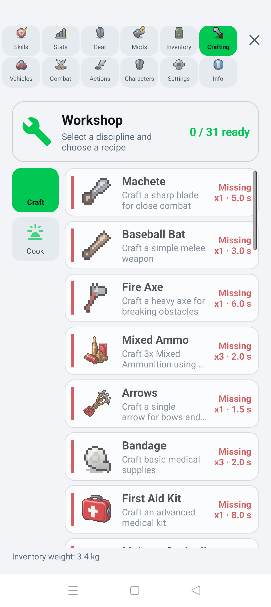
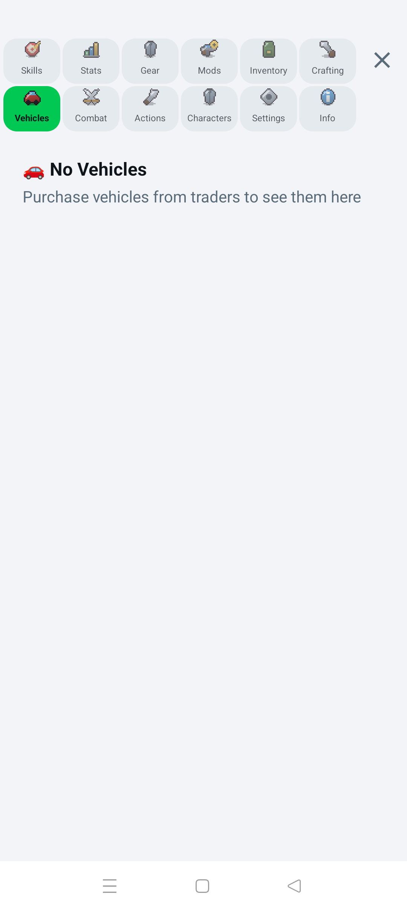
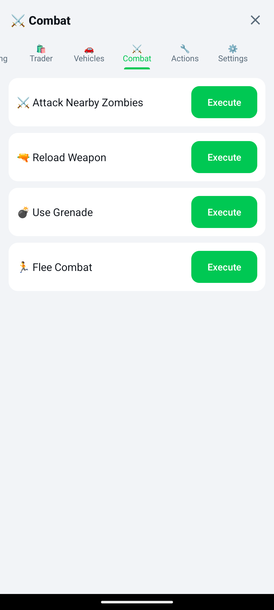
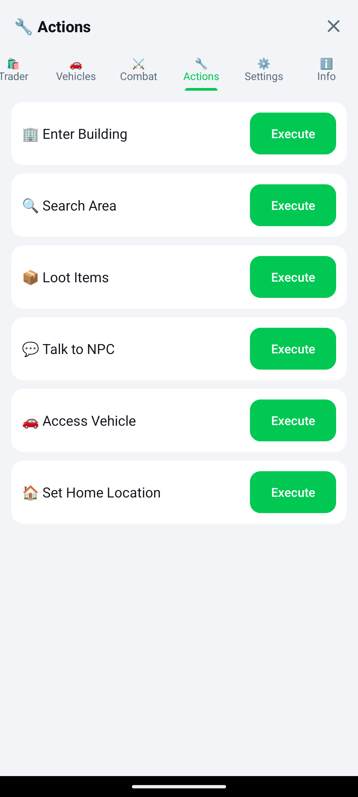
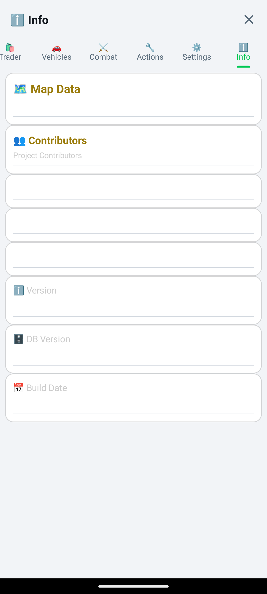

  

    
    
    
    
    
  

  <h1>ZombieEscape</h1>
  
<strong>An open-world, location-based zombie survival game for Android.</strong>

ZombieEscape turns real streets and buildings into a survival game map. Explore your surroundings, collect supplies, fight zombies, meet NPC factions, and gather the resources needed to survive.

The main development repository is private. This public preview repository provides project information, screenshots, development updates, and future Android releases. It does not contain the game's source code.

## Development status

ZombieEscape is playable and under active development. Features, visuals, and balancing may change. Combat and NPC collision avoidance are still being improved.

> **Initial building load:** After setting your spawn point and home base, the first download and processing of nearby building footprints may take some time. This is expected during development and should become faster when the final tile provider is integrated. Once an area has been loaded, its building data is cached locally, so subsequent loads are significantly faster.

> **Satellite view:** The Admin Panel includes an option to switch between the standard map and satellite imagery. Satellite view currently provides a noticeably better-looking and more detailed map presentation.

Current game version: **1.1.9** (version code 10109)

A full version-by-version history is available in the [Changelog](CHANGELOG.md).

No public APK is available yet. Built development versions may be provided on request for testing. Public test builds will be published on the [Releases page](https://github.com/arn-c0de/ZombieEscape-Preview/releases) when they are ready.

## Current app pages

  
  
  
  
  
  
  
  
  
  
  
  

## Gameplay screenshots

  
  

## Features

- **Real-world map:** Uses OpenStreetMap data for roads, buildings, and landmarks.
- **GPS and joystick movement:** Explore using device location or on-screen controls.
- **Dynamic zombies:** Spawn rates and zombie types depend on the surrounding area.
- **NPC factions:** Hostile, neutral, friendly, and trader NPCs find shelter, collect loot, store items, and defend themselves.
- **NPC daily life:** NPCs follow a day/night routine with sleep, survival priorities, and individual personality traits.
- **Combat:** Supports player-versus-AI and AI-versus-AI encounters, with retaliation AI and on-map combat effects (floating damage numbers and health bars).
- **Smarter navigation:** Plan-then-steer A\* pathfinding routes NPCs around dense, adjacent buildings instead of getting stuck in corners.
- **Injuries and treatment:** Tracks injuries by body part, including bleeding, fractures, and infection; treatments consume medical supplies.
- **Loot and inventory:** Buildings have loot tables and cooldowns, while inventory uses weight limits and item stacks.
- **Crafting, cooking, and equipment:** Players can craft items, cook food at persistent campfires and stoves, and equip weapons, armor, and attachments.
- **Weapon modding:** A modular attachment workbench with a live pixel-art view lets you fit stocks, optics, magazines, and muzzle devices; mods are reflected on the weapon sprite and paperdoll.
- **Housing and raids:** Claim player houses, defend against NPC house raids, and trigger survivor-rescue events.
- **Building interiors:** Enter shops and buildings with their own interior layouts, power, and lighting.
- **Vehicles and aircraft:** Several vehicle types can be acquired, stored, and driven, with animated vehicle sprites on the map.
- **Living environment:** Real-time day/night lighting with a clock HUD, an app-wide day/night theme, and animated map assets such as forest vegetation.
- **Persistent world:** The app saves player progress, inventory, vehicles, NPCs, houses, interiors, and looted buildings.

## Player wiki

The complete player guide is versioned in this repository under [`wiki/`](wiki/Home.md). It covers getting started, controls, survival, buildings and loot, combat, medical care, inventory and equipment, crafting, skills, NPCs and traders, houses and interiors, vehicles, events, settings, and troubleshooting.

The same content is intended for the repository's [GitHub Wiki](https://github.com/arn-c0de/ZombieEscape-Preview/wiki), while the in-repository copy remains the canonical source and can be reviewed with normal commits.

## Development simulators

The private development project includes standalone Python simulators for testing and tuning important game systems without running the Android app:

- **Pathfinding simulator:** Visualizes NPC movement and obstacle avoidance, collects analytics, and helps tune movement parameters.
- **NPC behaviour simulator:** Tests goal selection, survival priorities, and autonomous trading scenarios against the Kotlin implementation.
- **Loot simulator:** Reads the current item catalog and loot configuration, then reports spawn statistics for each building type.

These development tools are part of the private source repository and are not included in this public preview.

## APK releases

Future APK builds will be attached to entries on the [Releases page](https://github.com/arn-c0de/ZombieEscape-Preview/releases). Only install files published directly by this repository. Release notes will identify the Android requirements, known issues, and build type.

Development builds may also be available to testers on request. To request a build, [open an issue](https://github.com/arn-c0de/ZombieEscape-Preview/issues/new) or email `arn-c0de@protonmail.com` and include your Android device model and Android version. Access to development builds is considered individually and is not guaranteed.

## Contributing to the private project

The main repository is not publicly accessible, but collaboration requests are welcome.

To express interest, either [open an issue](https://github.com/arn-c0de/ZombieEscape-Preview/issues/new) in this preview repository or email `arn-c0de@protonmail.com`. Please include:

- A short introduction
- The area you would like to contribute to
- Relevant Android, Kotlin, game development, design, testing, or documentation experience
- Links to previous work, if available

Do not include passwords, access tokens, private keys, or other sensitive information in an issue. Repository access is considered individually and is not guaranteed.

## License and usage

All screenshots, game assets, names, and other material in this repository are provided for project preview purposes unless stated otherwise. They may not be copied, redistributed, sold, or used in another project without prior written permission.

The ZombieEscape source code remains private and is not licensed through this preview repository.

Repository: <https://github.com/arn-c0de/ZombieEscape-Preview>

**Navigation:** [README](README.md) | [Player Wiki](wiki/Home.md) | [Future Plans](PLANS.md) | [Project History](HISTORY.md) | [Changelog](CHANGELOG.md)
